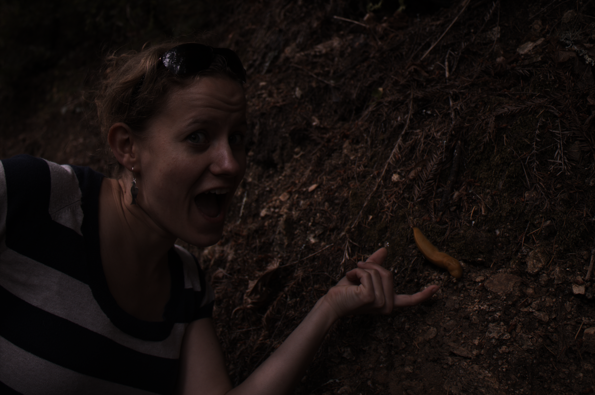
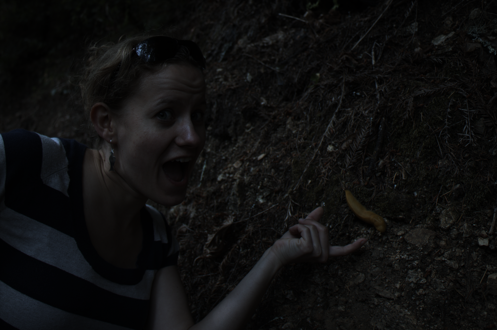
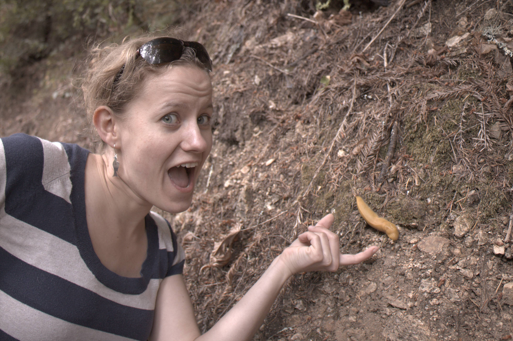
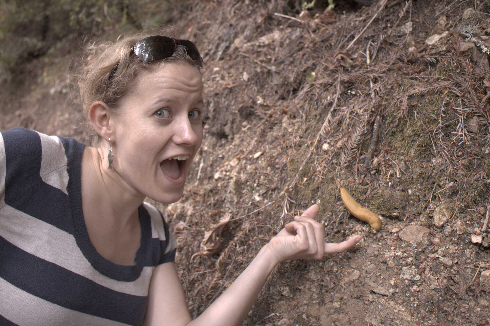
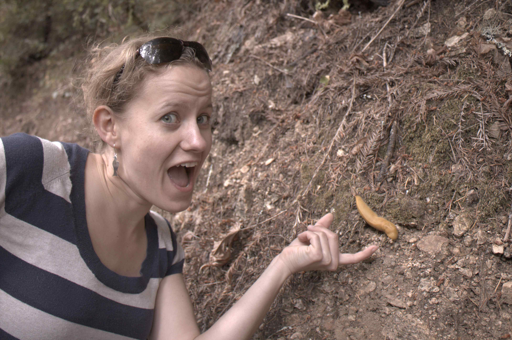
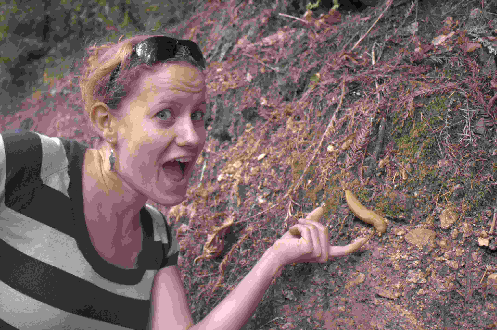

## Implement a basic image processing pipeline

Homework Assignment 1  
Environment: MATLAB

## Initials

```matlab
tiff_img = imread('C:/Users/ksj/MATLAB/Projects/A1/assign1/data/banana_slug.tiff');
[Height, Width] = size(tiff_img);
X = ['Image Height : ',num2str(Height),', Image Width : ',num2str(Width)];
disp(X);
disp(class(tiff_img));
img = double(tiff_img);
imwrite(tiff_img, 'tiff_img.png');
```
<p align="center">
    
    <p align="center">'<tiff image file></p> 
</p>

banana_slug.tiff file is loaded using imread function.  
Using size and class, we obtain information of the image format.  
Its size is 2856 * 4290 (Height * Width), and each value is a unit16 format.  
For further process, we change the format to double, and save it as img.  


## Linearization

```matlab
img = (img - 2047)/(15000-2047);
img = max(0, img);
img = min(1, img);
imwrite(img, 'img_Linearization.png');
```
Because only 14 of these pixesl contain useful data, we convert the image into a linear array within the range [0,1].  
Using min and max functions, I removed values above 1 and below 0.  

<span align="center">
    
    <p align="center">Linearization</p> 
</span>


## Identifying the Correct Bayer Pattern

```matlab
ba1 = img(1:2:end, 1:2:end);
ba2 = img(1:2:end, 2:2:end);
ba3 = img(2:2:end, 1:2:end);
ba4 = img(2:2:end, 2:2:end);
mean_ba = [mean(ba1(:)), mean(ba2(:)), mean(ba3(:)), mean(ba4(:))];
disp(mean_ba);
```
To identify which Bayer pattern is used, I compared the mean value of each space of the 2x2 squares.  
mean_ba shows the mean values, and from here we can acknowledge that the mean of ba2 and ba3 have similar values(=green).  
Since I know the greens, now i need to figure out between RGGB and BGGR.  

```matlab
img_rggb = cat(3, ba1, ba3, ba4);
img_bggr = cat(3, ba4, ba3, ba1);
imwrite(min(1, img_rggb*5), 'img_BayerPattern_rggb.png');
imwrite(min(1, img_bggr*5), 'img_BayerPattern_bggr.png');
img_rgb = img_rggb;
```
<p align="center">
    <table>
        <tr>
            <th></th>
            <th></th>
        </tr>
        <tr>
            <th><p align = "center">Image as RGGB</p></th>
            <th><p align = "center">Image as BGGR</p></th>       
        </tr>
    </table>
</p>

Now I compare the results by concatenating 3 values in each format.  
Knowing that the banana slug should have a yellow color, I set RGGB as the Bayer pattern.  


## White Balancing
### White world automatic white balancing
```matlab
im_r = max(max(img_rgb(:, :, 1)));
im_g = max(max(img_rgb(:, :, 2)));
im_b = max(max(img_rgb(:, :, 3)));
img_wb = cat(3, img_rgb(:,:,1) * im_g / im_r, img_rgb(:,:,2), img_rgb(:,:,3) * im_g / im_b);
imwrite(img_wb, 'img_WhiteBalancing.png');
```

<p align="center">
    
    <p align="center">White Balancing</p> 
</p>

The image has a high Green value overall, White Balancing is done to adjust Red and Blue values.  
Red and Blue values are incresed by a certain ratio obatined.  
Here I used 'white world automatic white balancing' for this assignment.  

### Gray world automatic white balancing
```matlab
im_r = mean(mean(img_rgb(:, :, 1)));
im_g = mean(mean(img_rgb(:, :, 2)));
im_b = mean(mean(img_rgb(:, :, 3)));
img_wb = cat(3, img_rgb(:,:,1) * im_g / im_r, img_rgb(:,:,2), img_rgb(:,:,3) * im_g / im_b);
imwrite(img_wb, 'img_GrayBalancing.png');
```
<p align="center">
    
    <p align="center">Gray Balancing</p>
</p>

This is the script for 'gray world automatic white balancing'. It was not used for this assignment.  

## Demosaicing

```matlab
img_wb_dem_r = interp2(img_wb(:,:,1));
img_wb_dem_g = interp2(img_wb(:,:,2));
img_wb_dem_b = interp2(img_wb(:,:,3));
img_wb_dem = cat(3, img_wb_dem_r, img_wb_dem_g, img_wb_dem_b);
imwrite(img_wb_dem, 'img_Demosaicing.png');
```
To retrieve color, demosaicing is needed.  
Here instead of using the demosaic function, it is improvised using interp2 function.  

<p align="center">
    
    <p align="center">Demosaicing</p>
</p>

## Brightness Adjustment and Gamma Correction

```matlab
img_wb_dem_gray = rgb2gray(img_wb_dem);
img_wb_dem = min(1, img_wb_dem * 2.8);
if img_wb_dem_gray <= 0.0031308
    img_wb_dem_out = 12.92 * img_wb_dem;
else
    img_wb_dem_out = (1.055) * power(img_wb_dem, 1/2.4) - 0.055;
end
imwrite(img_wb_dem_out, 'img_GammaCorrection.png');
```
<p align="center">
    
    <p align="center">Brightness Adjustment and Gamma Correction</p>
</p>

Still, the image is too dark, I adjusted the image brightness by 2.8.
Then, gamma correction(tone reproduction) was applied to the image.


## Compression

```matlab
quality_value = [95, 70, 50, 35, 20, 10, 5];
quality_size = size(quality_value);
disp(quality_size);
for i = 1:7
    file_name = 'img_wb_dem_gamma_q' + string(quality_value(i)) + '.jpeg';
    imwrite(img_wb_dem_out, file_name, 'quality', quality_value(i));
end
```

     
<p align="center">
    <table>
        <tr>
            <th></th>
            <th></th>
            <th></th>
            <th></th>
        </tr>
        <tr>
            <th><p align = "center">Quality 100%</p></th>
            <th><p align = "center">Quality 95%</p></th>
            <th><p align = "center">Quality 70%</p></th>
            <th><p align = "center">Quality 50%</p></th>           
        </tr>
        <tr>
            <th></th>
            <th></th>
            <th></th>
            <th></th>
        </tr>
        <tr>
            <th><p align = "center">Quality 35%</p></th>
            <th><p align = "center">Quality 20%</p></th>
            <th><p align = "center">Quality 10%</p></th>
            <th><p align = "center">Quality 5%</p></th>   
        </tr>
    </table>
</p>

Finally, i apply compression to the image in several values.  
From quality value 35 and  lower, compression can be easily observed.


