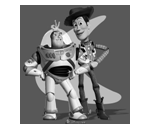

## Implement Poisson Blending

Homework Assignment 3  
Environment: MATLAB
Student ID: 2021314109
Student Name: Seongjean Kim

## Toy Problem

```matlab
function im_out = toy_reconstruct(toyim)

[imh, imw, nn] = size(toyim);
toyim = im2double(toyim);
im_size = imh*imw;
im2var = zeros(imh, imw);
im2var(1:im_size) = 1:im_size;

A = sparse(imh*(imw-1)+(imh-1)*imw+1, im_size);
b = zeros(im_size, nn);
e = 0;

for h = 1:imh
    for w = 1:imw-1
        e = e+1;
        A(e,im2var(h,w+1)) = 1;
        A(e,im2var(h,w)) = -1;
        b(e) = toyim(h,w+1) - toyim(h,w);
    end
end

for w = 1:imw
    for h = 1:imh-1
        e = e+1;
        A(e, im2var(h+1,w)) = 1;
        A(e, im2var(h,w)) = -1;
        b(e) = toyim(h+1,w) - toyim(h,w);
    end
end

e = e+1;
A(e, im2var(1,1)) = 1;
b(e) = toyim(1,1);

v = A \ b;
im_out = reshape(v, [imh, imw]);
end
```
<p align="center">
    
    
    <p align="center">Input and Result of toy_reconstruct.m</p> 
</p>

Each video file (baby2.mp4, face.mp4, own.mp4) is loaded frame by frame.
Becuase the value of each video is in the range [0, 255], I converted this to [0,1].
Then, for further use, the video color space is transfered from RGB to YIQ.
The result is returned as frames(height, width, channel, frame index).


## Laplacian Pyramid

```matlab
function [output, residual] = laplacian_pyramid(GSD, input)
    [height, width, ~] = size(input);
    img_blur = imgaussfilt(input, GSD);
    residual = input - img_blur;
    output = img_blur(1:2:height, 1:2:width, :);
end
```
<p align="center">
    
    <p align="center">Laplacian Pyramid</p> 
</p>


The laplacian pyramid is obtained by this function.
The Gaussian standard deviation is given as a value, and the input is a certain frame from frames.
For each frame, this function is repeated recursively for a number of times to obtain several levels of the Laplacian pyramid.
By this process, the residuals of each level is obtained.


```matlab
function output = upsample(gaussian_in, residual_in)
    gaussian_temp = imresize(gaussian_in, 2);
    output = gaussian_temp + residual_in;
end
```
<p align="center">
    
    <p align="center">Upsampling</p> 
</p>

Using the function implemented above, such Laplacian pyramid for each frame can be upsampled to reform the original image of that frame.


## Temporal Filtering

```matlab
function Hd = butterworthBandpassFilter(Fs, N, Fc1, Fc2)
    h  = fdesign.bandpass('N,F3dB1,F3dB2', N, Fc1, Fc2, Fs);
    Hd = design(h, 'butter');
end
```

<p align="center">
    
    <p align="center">Temporal filtering for face</p> 
</p>

Temporal filtering is based on butterworthBandpassFilter. 
Using this function, the frequency band of interest is extracted.
The values used for baby2.mp4 is Fs = 30, N = 256, Fc1 = 0.83, Fc2 = 1.16
The values used for face.mp4 is Fs = 30, N = 256, Fc1 = 0.8, Fc2 = 1.0


## Extracting the Frequency Band of Interest

```matlab
function output = extracting(Hd, input)
    [height, width, ch, frame_index] = size(input);
    output = zeros(height, width, ch, frame_index);
    out_pixel = zeros(frame_index, ch);
    Hd_fft = freqz(Hd, frame_index);
    for h = 1: height
        for w = 1: width
            for c = 1:ch
                out_pixel(:,ch) = input(h,w,ch,:);
                out_pixel_fft = fft(out_pixel);
                out_filtered = abs(ifft(out_pixel_fft .* Hd_fft));
                output(h,w,ch,:) = out_filtered(:, ch);
            end
        end
    end
end
```
<p align="center">
    
    <p align="center">Residual image multiplied by 5</p> 
</p>

In this process, freqz function is used to extract Hd_fft info.
What is returned is the frequency components of the filter for fast computation.


## Image Reconstruction
```matlab
frames_recon = zeros(height, width, ch, frame_index);

R_Ex_Re_0 = zeros(size(R_Ex_0,1), size(R_Ex_0,2), ch);
R_Ex_Re_1 = zeros(size(R_Ex_1,1), size(R_Ex_1,2), ch);
R_Ex_Re_2 = zeros(size(R_Ex_2,1), size(R_Ex_2,2), ch);
R_Ex_Re_3 = zeros(size(R_Ex_3,1), size(R_Ex_3,2), ch);
G_Ex_Re_4 = zeros(size(G_Ex_4,1), size(G_Ex_4,2), ch);
disp(size(R_Ex_3,1));
disp(size(G_Ex_4,1));
for i = 1:3
    for t = 1: frame_index
        R_Ex_Re_0(:,:,i) = R_Ex_0(:,:,i,t);
        R_Ex_Re_1(:,:,i) = R_Ex_1(:,:,i,t);
        R_Ex_Re_2(:,:,i) = R_Ex_2(:,:,i,t);
        R_Ex_Re_3(:,:,i) = R_Ex_3(:,:,i,t);
        G_Ex_Re_4(:,:,i) = G_Ex_4(:,:,i,t);
        frame_recon = frames(:,:,i,t) + upsample(upsample(upsample(upsample(G_Ex_Re_4, 120*R_Ex_Re_3), R_Ex_Re_2), R_Ex_Re_1), R_Ex_Re_0);
        frames_recon(:,:,i,t) = frame_recon(:,:,i);
    end
end
```

<p align="center">
    
    <p align="center">face.mp4 with Eulerian video magnification</p>
</p>


<p align="center">
    
    <p align="center">baby2.mp4 with Eulerian video magnification</p>
</p>

This process upsamples the Laplacian pyramid into a single image per frame.
By setting the a's as different values, we can obtain results with different frequency values amplified.
The frames are exported and saved as a video.

## Capture and Motion-Magnify your own Video

<p align="center">
    
    <p align="center">Own Video Motion-Magnify</p>
</p>
 
This is the result of motion magnifying on a short clip, where the sleeve of the jacket was shifted slightly due to wind blow.
