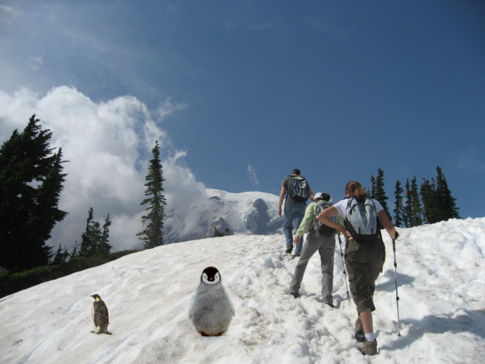
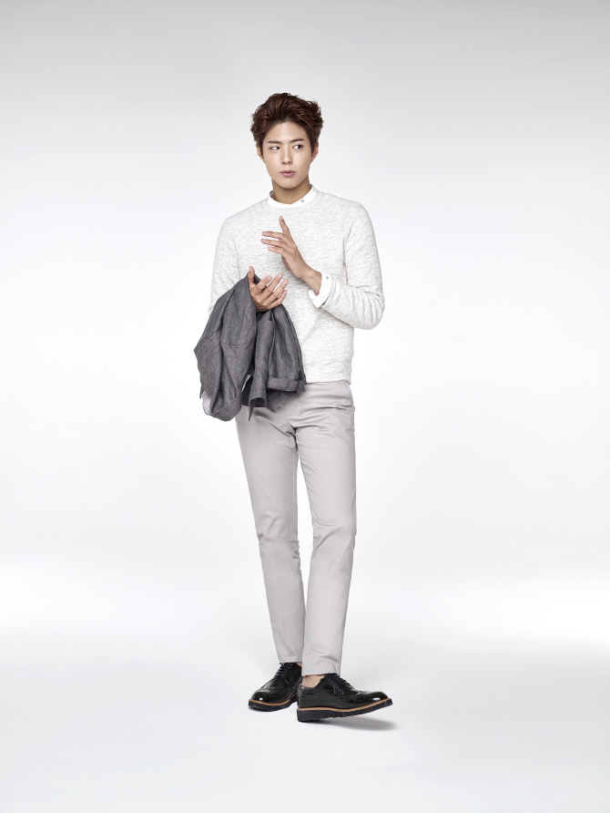

## Implement Poisson Blending

Homework Assignment 3  
Environment: MATLAB
Student ID: 2021314109
Student Name: Seongjean Kim

This assignment focuses on gradient-domain processing, and in particular Poisson blending.
Functions are implemented to blend an object or textrue from a source into a target image.


## Toy Problem

```matlab
function im_out = toy_reconstruct(toyim)

[imh, imw, nn] = size(toyim);
toyim = im2double(toyim);
im_size = imh*imw;
im2var = zeros(imh, imw);
im2var(1:im_size) = 1:im_size;

A = sparse(imh*(imw-1)+(imh-1)*imw+1, im_size);
b = zeros(im_size, nn);
e = 0;

for h = 1:imh
    for w = 1:imw-1
        e = e+1;
        A(e,im2var(h,w+1)) = 1;
        A(e,im2var(h,w)) = -1;
        b(e) = toyim(h,w+1) - toyim(h,w);
    end
end

for w = 1:imw
    for h = 1:imh-1
        e = e+1;
        A(e, im2var(h+1,w)) = 1;
        A(e, im2var(h,w)) = -1;
        b(e) = toyim(h+1,w) - toyim(h,w);
    end
end

e = e+1;
A(e, im2var(1,1)) = 1;
b(e) = toyim(1,1);

v = A \ b;
im_out = reshape(v, [imh, imw]);
end
```
<p align="center">
    
    
    <p align="center">Input(Left) and Result(Right) of toy_reconstruct.m</p> 
</p>

toy_reconstruction function is a practice on implemntation for gradient domain processing.
The process considers each x and y axis seperately and stores the gradient values using sparse function.
The first for loop is processed on each row, and the next loop is processed on each column.
After each process is completed, the \ function of matlab is used to compute division in the opposite direction.
The resulting image is the returned as above.

The overall difference between the original and result image was as follow.

Error: 0+2.5417e-06i

Which, we can conclude that the two images are almost identical.
Now that we understand how to implement gradient domain processing, we move on to implementing Poisson blending.


## Poisson Blending

```matlab
function p_blend = poissonBlend(im, mask, im_background)

[imh, imw, nn] = size(im);

im2var = zeros(imh, imw);
im_size = imh*imw;
im2var(1:im_size) = 1: im_size;

A = sparse(im_size, im_size);
b = zeros(im_size, nn);
e = 0;
for h = 1:imh
    for w = 1:imw
        e = e+1;
        if mask(h,w) == 1
            A(e, im2var(h,w)) = 4;
            A(e, im2var(h,w-1)) = -1;
            A(e, im2var(h,w+1)) = -1;
            A(e, im2var(h-1,w)) = -1;
            A(e, im2var(h+1,w)) = -1;
            b(e,:) = 4*im(h,w,:) - im(h+1,w,:) - im(h,w+1,:) - im(h-1,w,:) - im(h,w-1,:);
        else
            A(e, im2var(h,w)) = 1;
            b(e,:) = im_background(h,w,:);
        end
    end
end
v = A \ b;
p_blend = reshape(v, [imh, imw, nn]);
end
```

Using the toy_reconstruct function as the base, we now add blending onto the process.
The background image for this process will be hiking.jpg, and images blended to this will be penguin-chick.jpeg and penguin.jpg
Here, the for loop is repeated for each pixel of the input image. 
For pixel locations which are expected to be blended with the input image, the gradient value is filtered considering nearby gradient values.
Else, for pixel locations which are not expected to have any blending operation simply get the gradient value of the background image.
Then, this image is reshpaed back as how it was inputted.
The result of this function is shown below, where the two penguins are blendded into the hiking image.

<p align="center">
    
    <p align="center">Result of Poisson Blending</p> 
</p>

However, from here we can see that the blending process was not perfect.
Pixels nearby the penguins show a blurred shape, which can be observed with a little attention.
This ploblem is occured because this function uses the input image's gradient as the main one.
To fix this matter, an improved way will be introduced in the next section.


## Blending with Mixed Gradient

```matlab
function m_blend = mixedBlend(im, mask, im_background)

[imh, imw, nn] = size(im);

im2var = zeros(imh, imw);
im_size = imh*imw;
im2var(1:im_size) = 1: im_size;

A = sparse(im_size, im_size);
b = zeros(im_size, nn);
e = 0;

im_grad = zeros(1, nn);
b_grad = zeros(1, nn);

for h = 1:imh
    for w = 1:imw
        e = e+1;
        if mask(h,w) == 1
            A(e, im2var(h,w)) = 4;
            A(e, im2var(h,w-1)) = -1;
            A(e, im2var(h,w+1)) = -1;
            A(e, im2var(h-1,w)) = -1;
            A(e, im2var(h+1,w)) = -1;
            index = [h+1 w; h w+1; h-1 w; h w-1];
            for n = 1:4
                im_grad(1,:) = im(h,w,:) - im(index(n,1),index(n,2),:);
                b_grad(1,:) = im_background(h,w,:) - im_background(index(n,1),index(n,2),:);
                if abs(im_grad(1,:)) >= abs(b_grad(1,:))
                    b(e, :) = b(e, :) + im_grad(1, :);
                else
                    b(e, :) = b(e, :) + b_grad(1, :);
                end          
            end
        else
            A(e, im2var(h,w)) = 1;
            b(e, :) = im_background(h,w,:);
        end
    end
end
v = A \ b;
m_blend = reshape(v, [imh, imw, nn]);
m_blend(:,:,:) = max(0, m_blend(:,:,:));
m_blend(:,:,:) = min(1, m_blend(:,:,:));
end
```

Blending with mixed gradients follows the same process as poisson blending.
The only difference is the method used to decide b.
Here, the gradient value of the input image and background image are compared using abs.
The bigger gradient is used for each pixel, therefore errors like the result of Poisson blending are solved.
The results are as below.

<p align="center">
    
    <p align="center">Result of Mixed Blending</p> 
</p>

We now see that the results blend more naturally into the background image compared to the results of Poisson blending.


## Blending with my own examples

Below images are results of some objects blended into a background using poisson blending.

<p align="center">
    
    
    
    <p align="center">Result of human blended to Yonsei Univ. campus</p> 
</p>

<p align="center">
    
    
    
    <p align="center">Result of dolphin blended to a sea image</p> 
</p>

<p align="center">
    
    
    
    <p align="center">Result of octopus blended to a desert image</p> 
</p>

Below images are results of some objects blended into a background using mixed blending.

<p align="center">
    
    
    
    <p align="center">Result of human blended to Yonsei Univ. campus</p> 
</p>

<p align="center">
    
    
    
    <p align="center">Result of dolphin blended to a sea image</p> 
</p>

<p align="center">
    
    
    
    <p align="center">Result of octopus blended to a desert image</p> 
</p>

From the images above, we can see that a same problem has happened for all of them.
The input image which is blended to the result is slightly transparent.
It is not really transparent, but such results have happened because the background image's gradient has affected the resulting image too much.
To solve such results, the importance ratio of the image and the background, currently set as 1 : 1 can be modified so that the input image has a higher importance.
In this way, such problems could be partly solved.
However, what we aimed to do was to implement a blending method which merges in the object naturally to the background.
Such objectives were achieved through the functions implemented above.
