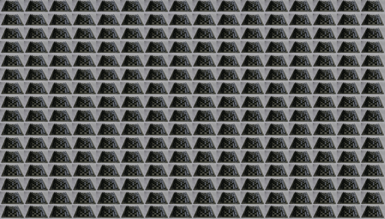
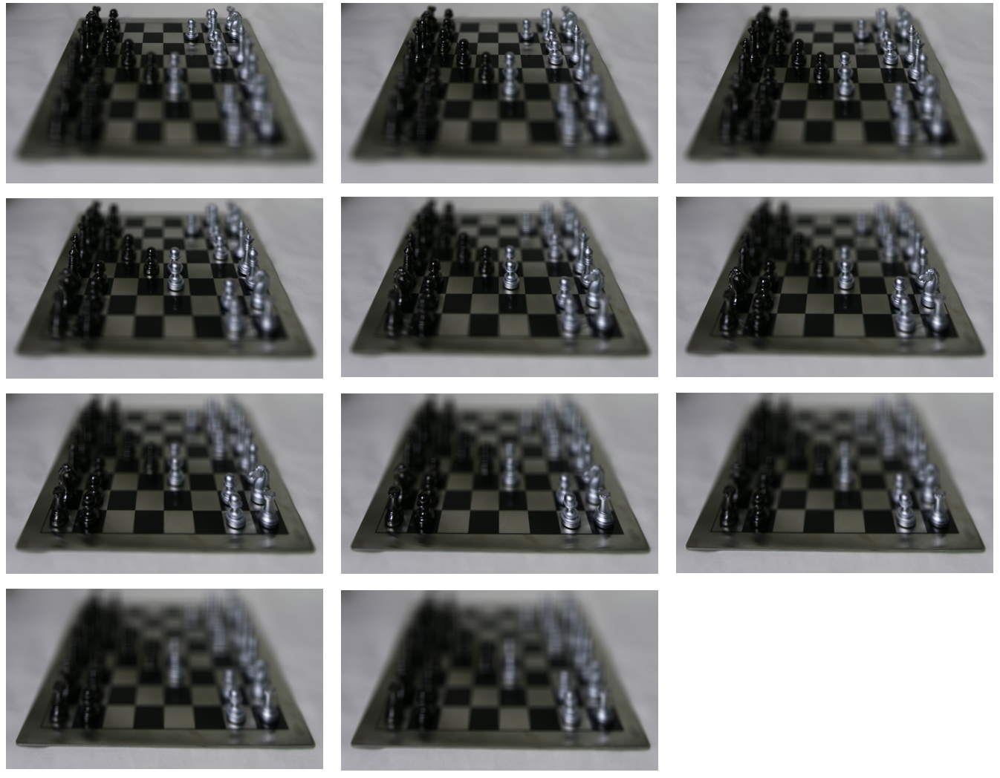
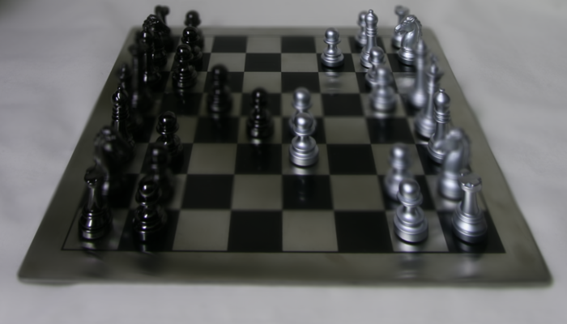
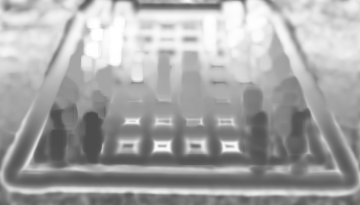

## Light Field Rendering, Focal Stacks, and Depth from Defocus

Homework Assignment 5
Environment: MATLAB
Student ID: 2021314109
Student Name: Seongjean Kim

This assignment focuses on exploring light fields, focal stacks, and depth from defocus.
Having access to the full light field of a scene allows creating images that correspond to different viewpoints.
Such different viewpoints will be combined to create a all-focus image as a result.


## Initials

First, the light field image is loaded to Matlab.
Then, we create a 5-dimensional array L(u, v, s, t, c) from the loaded image.
From above, u and v correspond to the coordinates on the aperture,
s and t correspond to the coordinates on the lenslet array.
c corresponds to the color channels of the input, where in this project c will be 3.

```matlab
img_lightfields = imread('chessboard_lightfield.png');

global u v s t c
u = 16;
v = 16;
s = size(img_lightfield, 1) / u;
t = size(img_lightfield, 2) / v;
c = 3;

img_array = zeros(u, v, s, t, c);
img_array = uint8(img_array);
for l = 1:s
    for m = 1:t
        for n = 1:u
            for o = 1:v
                img_array(n, o, l, m, 1) = img_lightfield(u*(l-1)+n, v*(m-1)+o, 1);
                img_array(n, o, l, m, 2) = img_lightfield(u*(l-1)+n, v*(m-1)+o, 2);
                img_array(n, o, l, m, 3) = img_lightfield(u*(l-1)+n, v*(m-1)+o, 3);
            end
        end
    end
end
```

## Sub-aperture views
Sub-apertures are created by rearranging the pixels in the light field image.

```matlab
img_subaperture = uint8(zeros(u*s, v*t, c));
for n = 1:u
    for o = 1:v
        img_subaperture(s*(n-1)+1: s*(n-1)+s, t*(o-1)+1: t*(o-1)+t, :) = img_array(n, o, :, :, :);
    end
end
imwrite(img_subaperture, 'results/Sub-aperture_result.png');
```

The resulting image is shown below in a form of a 16x16 2D mosaic.
The u value is increased vertically, and the v value is increased horizontally.
This image will be used for processing in further steps.

<p align="center">
    
    <p align="center">Sub-aperture results in mosaic form</p> 
</p>

## Refocusing and focal-stack generation
We choose the best fit while changing the depth value.
Depth values are given as 0, 0.2, 0.4, ... 2.0.
A total of 11 different images will be produced using the depth values.

```matlab
depth = 11;
refocus = uint8(zeros(s, t, c, depth));
for depth_t = 1:depth
    refocus(:, :, :, depth_t) = depth_combine(img_array, 0.2*(depth_t-1));
end
```

This process is done using the depth_combine function implemented.

```matlab
function [output] = depth_combine(img_array, depth_t)

    global u v s t c
    img_array = double(img_array);
    output = zeros(s, t, c);
    for l = 1:s
        for m = 1:t
            count = 0;
            for n = 1-u/2:u/2
                l_temp = l + round(n*depth_t);
                for o = 1-v/2:v/2
                    m_temp = m - round(o*depth_t);
                    if l_temp <= s && l_temp >= 1 && m_temp <= t && m_temp >= 1
                        output(l, m, 1) = output(l, m, 1) + img_array(n+u/2, o+v/2, l_temp, m_temp, 1);
                        output(l, m, 2) = output(l, m, 2) + img_array(n+u/2, o+v/2, l_temp, m_temp, 2);
                        output(l, m, 3) = output(l, m, 3) + img_array(n+u/2, o+v/2, l_temp, m_temp, 3);
                        count = count + 1;
                    end
                end
            end
            output(l, m, :) = output(l, m, :) / count;
        end
    end
    output = uint8(output);
end
```
Below result shows images produced with different depth values.
See how the focus area of the image differes for each depth value.
Depth value 0 image is focused on the back part of the image, while as the depth value increases, the focus moves forward.
However, at a certain point the focus is shifted too much and the whole image shows blur without any focus point found.

<p align="center">
    
    <p align="center">Focal-stack results with depth value 0.0(top-left) to 2.0(bottom-center)</p> 
</p>

## All-focus image and depth from defocus
Four different characteristics(Luminance, Low, High, Sharpness) of the image will be used to make all-focus image.
Luminance is a measure of light per area,
Low is used to blur the image using a Gaussian kernel of standard deviation 3.
High is used with low by subtracting the blur image from low to get a clear image.
Sharpenss weight is computed using a Gaussian kernel of standard deviation value 5.

```matlab
refocus = double(refocus);

stack_luminance = zeros(s, t, depth);
stack_low = zeros(s, t, depth);
stack_high = zeros(s, t, depth);
stack_sharpness = zeros(s, t, depth);

std_dev1 = 3;
std_dev2 = 5;

for depth_t = 1:depth
    img_focal_stack = refocus(:, :, :, depth_t);

    img_combined_xyz = rgb2xyz(img_focal_stack, 'ColorSpace', 'srgb');
    img_combined_lum = img_combined_xyz(:, :, 2);
    stack_luminance(:,:,depth_t) = img_combined_lum;

    img_combined_low = imgaussfilt(img_combined_lum, std_dev1);
    stack_low(:,:,depth_t) = img_combined_low;

    img_combined_high = img_combined_lum - img_combined_low;
    stack_high(:,:,depth_t) = img_combined_high;

    img_combined_sharp = imgaussfilt(img_combined_high .^ 2, std_dev2);
    stack_sharpness(:,:,depth_t) = img_combined_sharp;
end
```

Using the sharpness weight obtainied, we then compute the all-focus image along with a depth map.

```matlab
all_focus_result = zeros(s, t, c);
depth_map = zeros(s, t);

for l = 1:s
    for m = 1:t
        sharp_total = 0;
        for depth_t = 1:5:depth
            img_focal_stack = refocus(:, :, :, depth_t);
            sharp_value = stack_sharpness(l,m,depth_t);
            all_focus_result(l, m, 1) = all_focus_result(l, m, 1) + img_focal_stack(l, m, 1) * sharp_value;
            all_focus_result(l, m, 2) = all_focus_result(l, m, 2) + img_focal_stack(l, m, 2) * sharp_value;
            all_focus_result(l, m, 3) = all_focus_result(l, m, 3) + img_focal_stack(l, m, 3) * sharp_value;
            depth_map(l, m) = depth_map(l, m) + sharp_value * 0.2*(depth_t-1);
            sharp_total = sharp_total + sharp_value;
        end
        all_focus_result(l, m, :) = all_focus_result(l, m, :) / sharp_total;
        depth_map(l, m) = depth_map(l, m) / sharp_total;
    end
end

all_focus_result = uint8(all_focus_result);
depth_map = (1 - depth_map / 2);

imwrite(all_focus_result, 'results/all_focus_result.png');
imwrite(depth_map, 'results/img_depth_map.png');
```

The result is as below.

<p align="center">
    
    <p align="center">All-focus image result with std_dev values 3, 5</p> 
</p>


<p align="center">
    
    <p align="center">Depth map image with std_dev values 3, 5</p> 
</p>
